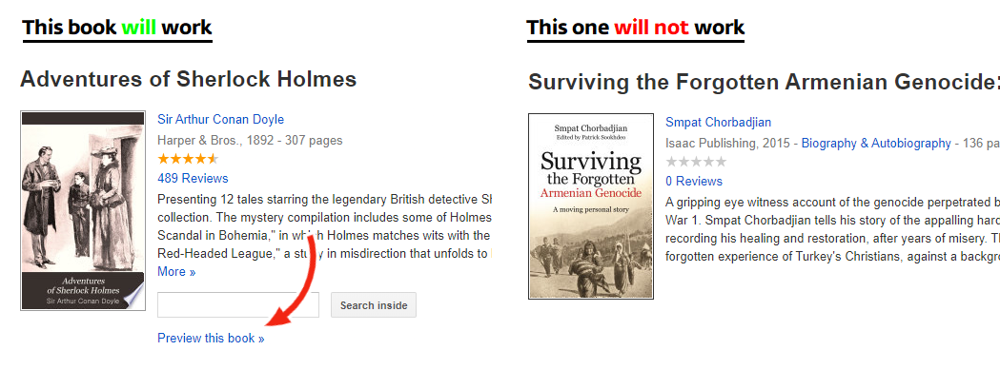

# Google Books Downloader
An open-source utility to scrape Google Books

## How to use

### Installing

**Step 0:** Python is required to run this utility. If you are new to programming, make sure to download and install the latest version of [Python](https://www.python.org/downloads) before proceeding.

**Step 1:** Download/clone the code to your local machine. Install the required dependencies listed in requirements.txt

(hint: run `pip3 install -r /[install-directory]/requirements.txt` from your console)

**Step 2:** Run gbd.py and go get 'em books.

(hint: run `python [install-directory]/gbd.py` from your console to run Google Books Downloader)

### Instructions

In order to download a material from Google Books, **it needs to have full or snippet view**. If a book does not have any of these, i.e. it can't be viewed on Google Books, then the utility can't (and practically, no one can) download the book.

**Step 1:** After running the utility, you'll be asked whether to download from URL or, in case you have *previously* downloaded it, from backup. At this point, type "Yes".

If you do have a backup file, type "No", then input the address of the backup and proceed to step 4.

**Step 2:** Enter the URL of the book you want to download.

In this step, Google Book Downloader will browse the book and fetch its pages, so you can take a short break while it does the job for you.

**Step 3:** After a couple minutes it'll be done processing the book. It is encouraged that you save the progress made so far and back it up. This will help you skip the previous step and save your time if you ever happen to download the same book again.

Type Yes to create a backup, otherwise--you know.

**Step 4:** Type the numbers of pages you'd like to download. Note that if a page you selected is not available in the preview, it will simply be skipped.

**Step 5:** We're almost done at this step. Just enter where to save the book; leave it blank and press enter to save them in your current directory.

Congrats! The book pages will be saved as images in the specified location in the highest quality available. You can now read them or combine in a PDF using online tools or desktop apps (I usually use Nitro or this [website](https://smallpdf.com/jpg-to-pdf) as an alternative).

---------

DISCLAIMER OF RESPONSIBILITY: The code is provided as-is without any further warranty. It is designed solely for legal usage; the author(s) of the code are not responsible for any illegal actions done by anyone using this code. Read the License for more information.
